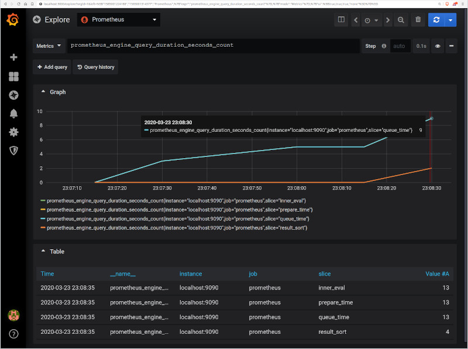

# Prometheus & Grafana

## Structure du projet
```
.
├── compose.yaml
├── grafana
│   └── datasource.yml
├── prometheus
│   └── prometheus.yml
└── README.md
```

[_compose.yaml_](compose.yaml)
```
services:
  prometheus:
    image: prom/prometheus
    ...
    ports:
      - 9090:9090
  grafana:
    image: grafana/grafana
    ...
    ports:
      - 3000:3000
```
Ce fichier Docker Compose définit une stack avec deux services : `prometheus` et `grafana`.
Lors du déploiement de la stack, Docker Compose va réaliser un mapping des ports par défaut de chaque service vers les ports équivalents sur l'hôte afin d'inspecter plus facilement l'interface Web de chaque service.
Assurez-vous que les ports 9090 et 3000 sur l'hôte ne sont pas déjà utilisés.

## Déploiement avec docker compose

```
$ docker compose up -d
Creating network "prometheus-grafana_default" with the default driver
Creating volume "prometheus-grafana_prom_data" with default driver
...
Creating grafana    ... done
Creating prometheus ... done
Attaching to prometheus, grafana

```

## Résultats attendus

La liste des conteneurs doit montrer deux conteneurs en cours d'exécution et le mappage de port comme ci-dessous :
```
$ docker ps
CONTAINER ID        IMAGE               COMMAND                  CREATED             STATUS              PORTS                    NAMES
dbdec637814f        prom/prometheus     "/bin/prometheus --c…"   8 minutes ago       Up 8 minutes        0.0.0.0:9090->9090/tcp   prometheus
79f667cb7dc2        grafana/grafana     "/run.sh"                8 minutes ago       Up 8 minutes        0.0.0.0:3000->3000/tcp   grafana
```
Accédez à `http://localhost:3000` dans votre navigateur Web et utilisez les identifiants de connexion spécifiés dans le fichier de composition pour accéder à Grafana. Il est déjà configuré avec prometheus comme source de données par défaut.



Accédez à `http://localhost:9090` dans votre navigateur Web pour accéder directement à l'interface Web de prometheus.

Arrêtez et supprimer les conteneurs. Utilisez `-v` pour supprimer les volumes si vous cherchez à effacer toutes les données.
```
$ docker compose down -v
```
